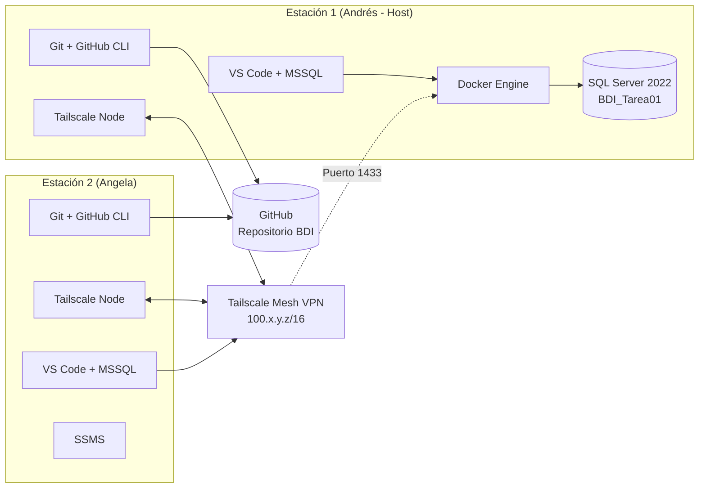
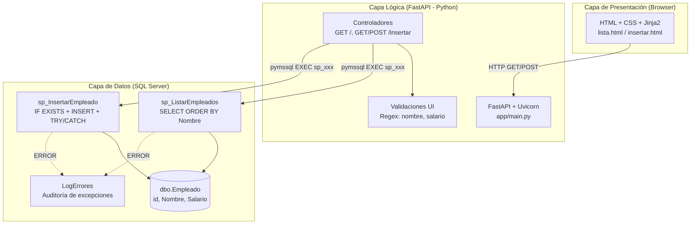

# Análisis de Resultados — Primera Tarea Programada BDI

**Curso:** Bases de Datos I — ITCR 2026  
**Profesor:** fquiros  
**Fecha de entrega:** Lunes 7 de septiembre 2026  
**Equipo:** Luis Andrés Acuña Pérez + Angela [Apellido]

---

## 1. Portada

| Campo | Detalle |
|-------|---------|
| **Proyecto** | Primera Tarea Programada — Prueba de Concepto |
| **Curso** | Bases de Datos I |
| **Institución** | Instituto Tecnológico de Costa Rica — Escuela de Ingeniería en Computación |
| **Profesor** | fquiros |
| **Integrantes** | Luis Andrés Acuña Pérez, Angela [Apellido] |
| **Fecha** | Setiembre 2026 |
| **Repositorio** | https://github.com/AndresAp01/BDI |

---

## 2. Índice de Contenido

1. [Portada](#1-portada)
2. [Índice de Contenido](#2-índice-de-contenido)
3. [Índice de Figuras](#3-índice-de-figuras)
4. [Introducción](#4-introducción)
5. [Descripción del Ambiente de Desarrollo](#5-descripción-del-ambiente-de-desarrollo)
   - 5.1 [Ambiente de Desarrollo: Diagrama de Red](#51-ambiente-de-desarrollo-diagrama-de-red)
   - 5.2 [Arquitectura de la Aplicación](#52-arquitectura-de-la-aplicación)
6. [Análisis de Resultados por Requisito](#6-análisis-de-resultados-por-requisito)
7. [Métricas del Proyecto](#7-métricas-del-proyecto)

## 4. Introducción

Este documento presenta el análisis de resultados de la **Primera Tarea Programada** del curso Bases de Datos I. La tarea consistió en implementar una prueba de concepto que conecta una base de datos Microsoft SQL Server a una aplicación web sencilla que permite consultar e insertar empleados mediante **Stored Procedures**.

El trabajo se desarrolló en **pareja** durante sesiones de trabajo (26 agosto – 4 septiembre 2026), utilizando un ambiente colaborativo donde el servidor de base de datos corre en un contenedor Docker en la máquina de un integrante y es accesible para amnbos mediante **Tailscale** (red mesh VPN).

Este análisis evalúa el cumplimiento de cada requisito del enunciado, documenta el ambiente de desarrollo y la arquitectura implementada, y presenta las métricas cuantitativas del proyecto.

---

## 5. Descripción del Ambiente de Desarrollo

### 5.1 Ambiente de Desarrollo: Diagrama de Red

**Figura 1.** Diagrama de red del ambiente colaborativo.

**Explicación del diagrama:**

- **Dos estaciones de trabajo** (Andrés y Angela) conectadas mediante **Tailscale**, que crea una red privada virtual (mesh) sobre Internet. Cada nodo obtiene una IP estatica `100.x.y.z`.
- **Servidor de base de datos:** Microsoft SQL Server 2022 corriendo en un **contenedor Docker** en la máquina de Andrés (host). El contenedor expone el puerto 1433 en la interfaz de Tailscale (`tailscale0`), no en localhost, permitiendo conexiones remotas seguras.
- **Conexión a la BD:** Ambos integrantes usan **VS Code con la extensión MSSQL** para conectarse a la BD usando la IP Tailscale del host (`100.112.85.50:1433`), usuario `sa` y contraseña compartida.
- **Control de versiones:** **Git + GitHub** (repo `AndresAp01/BDI`). Ambos hacemos push/pull via SSH. Commits atómicos.
- **IDE y cliente BD:** VS Code (editor principal) + extensión MSSQL (cliente de administración de objetos BD: tablas, SPs, consultas), Angela utiliza SSMS.
- **Tecnologías de conexión:** Tailscale, Docker, pymssql, FastAPI/uvicorn (servidor web).
---

### 5.2 Arquitectura de la Aplicación

**Figura 2.** Arquitectura en 3 capas.

**Explicación:**

| Capa | Tecnologías | Responsabilidad |
|------|-------------|-----------------|
| **Presentación** | HTML, CSS, Jinja2 Templates | Renderizar grid de empleados, formulario de inserción, mostrar mensajes de error/éxito. Validación HTML5 `pattern` + required. |
| **Lógica** | Python 3.11, FastAPI 0.115, Uvicorn, pymssql 2.3, python-dotenv | Recibir peticiones HTTP, validar formato de entrada (regex nombre/salario), invocar **exclusivamente Stored Procedures** vía `cursor.callproc()` / `cursor.execute("EXEC ...")`, manejar códigos de retorno (0=OK, 1=duplicado, 2=error), aplicar patrón PRG (Post-Redirect-Get). |
| **Datos** | MS SQL Server 2022, T-SQL | Almacenar datos (`Empleado`), ejecutar lógica de negocio en SPs (`sp_ListarEmpleados`, `sp_InsertarEmpleado`), auditar errores (`LogErrores`), validar duplicados programáticamente (`IF EXISTS`), transacciones atómicas (`BEGIN TRAN / COMMIT / ROLLBACK`). |

**Patrón de diseño:** **Arquitectura en 3 capas (3-tier)** con **separación estricta de responsabilidades**. La capa lógica **no contiene SQL** — solo invoca SPs. La capa de datos encapsula toda la lógica de acceso y validación de integridad.

**Protocolos:** HTTP/1.1 (navegador ↔ FastAPI), TDS 8.0 (pymssql ↔ SQL Server sobre Tailscale/WireGuard).

---

## 6. Análisis de Resultados por Requisito

En la siguiente tabla se evalúa cada elemento del enunciado según la rúbrica de evaluación.

| # | Requisito / Elemento | Implementado | % | Comentario |
|-- |----------------------|:------------:|:--:|------------|
| 1 | **BD creada** (`BDI_Tarea01`) | ✅ Sí | 100% | Script `01_crear_tabla.sql` crea BD y tabla. Verificada en contenedor. |
| 2 | **Tabla Empleado** (id PK identity, Nombre VARCHAR(128) NOT NULL, Salario MONEY NOT NULL) | ✅ Sí | 100% | Estructura exacta al enunciado. |
| 3 | **≥40 filas cargadas** via INSERT | ✅ Sí | 100% | 43 filas insertadas (`02_carga_datos.sql`). Incluyen casos para probar duplicados. |
| 4 | **App web en browser** (FastAPI + Jinja2) | ✅ Sí | 100% | `app/main.py` + templates. Accesible local y vía Tailscale. |
| 5 | **Conexión BD desde app** (pymssql) | ✅ Sí | 100% | `basedatos.py` con variables de entorno. Pool de conexiones por request. |
| 6 | **Grid inicial** empleados ordenados alfabéticamente (Nombre ASC) | ✅ Sí | 100% | `sp_ListarEmpleados` + `lista.html` + `ORDER BY Nombre ASC`. |
| 7 | **Botón "Insertar Empleado"** → formulario | ✅ Sí | 100% | Ruta `/insertar` GET + `insertar.html`. |
| 8 | **Validación nombre** (solo letras, guiones, espacios) en UI | ✅ Sí | 100% | Regex `^[A-Za-zÁÉÍÓÚáéíóúÑñ\- ]+$` en Python + HTML5 `pattern`. |
| 9 | **Validación salario** (monetario bien formado: dígitos, 1 punto, 2-4 decimales) en UI | ✅ Sí | 100% | Regex `^\d+(\.\d{2,4})?$` en Python + HTML5 `pattern`. |
| 10 | **Botón "Regresar"** vuelve a grid actualizado | ✅ Sí | 100% | `<a class="regresar" href="/">` en formulario. |
| 11 | **Botón "Insertar"** valida campos vacíos, formato, llama SP | ✅ Sí | 100% | POST `/insertar` → validaciones → `EXEC sp_InsertarEmpleado`. |
| 12 | **Mensajes error** en UI si validación falla | ✅ Sí | 100% | Template `insertar.html` muestra `{{ error }}` en rojo. |
| 13 | **SP Insertar valida duplicado programáticamente** (`IF EXISTS`, no índice UNIQUE) | ✅ Sí | 100% | `sp_InsertarEmpleado` usa `IF EXISTS (SELECT 1 FROM Empleado WHERE Nombre=@Nombre)`. |
| 14 | **SP retorna código error** si duplicado | ✅ Sí | 100% | Retorna `Resultado=1, Mensaje='Nombre de Empleado ya existe.'`. |
| 15 | **SP inserta** si no existe duplicado | ✅ Sí | 100% | `INSERT` dentro de `BEGIN TRAN / COMMIT`. Retorna `Resultado=0, Mensaje='Inserción exitosa.'`. |
| 16 | **Mensaje "Inserción exitosa"** + redirect a grid actualizado | ✅ Sí | 100% | `RedirectResponse 303` a `/` tras éxito. Grid muestra nueva fila. |
| 17 | **Mensaje "Nombre ya existe"** + queda en formulario | ✅ Sí | 100% | Re-render `insertar.html` con error del SP. |
| 18 | **Al menos 2 SPs** (listar + insertar) | ✅ Sí | 100% | `sp_ListarEmpleados`, `sp_InsertarEmpleado` + `LogErrores` audit. |
| 19 | **Bitácora** (Blogger + bitacora.md en repo) | ✅ Sí | 95% | 7 sesiones documentadas en Blogger. Falta volcar completo a `bitacora.md` del repo. |
| 20 | **Análisis de Resultados** (este documento) | 🟡 En curso | 80% | Estructura completa. Falta pulir métricas finales y exportar a PDF. |
| 21 | **GitHub con historial evolutivo** | ✅ Sí | 100% | 10+ commits atómicos desde 26 ago. Dos contribuyentes. |
| 22 | **Diagrama red colaborativo** | ✅ Sí | 100% | Incluido en sección 5.1 (Mermaid + explicación). |
| 23 | **Diagrama arquitectura app** | ✅ Sí | 100% | Incluido en sección 5.2 (Mermaid + tabla capas). |

---

## 7. Métricas del Proyecto

### 7.1 Métricas de Tiempo y Esfuerzo

| Métrica | Valor | Fuente |
|---------|-------|--------|
| **Fecha primera reunión** | 26 agosto 2026 | Blogger entrada 1 |
| **Fecha primer commit GitHub** | 26 agosto 2026 | `git log --reverse` |
| **Fecha última sesión documentada** | 4 septiembre 2026 | Blogger entrada 6 |
| **Total sesiones de trabajo** | 7 | Bitácora |
| **Horas totales estimadas** | ~15 h | Suma duraciones bitácora |
| **Horas Andrés** | ~7 h | Commits + bitácora |
| **Horas Angela** | ~8 h | Commits + bitácora |

### 7.2 Métricas de Código y Artefactos

| Métrica | Valor | Detalle |
|---------|-------|---------|
| **Líneas de código Python** | ~280 | `app/main.py` (121), `backend/main.py` (35), `backend/basedatos.py` (15), `00_probar_conexion.py` (39), `requirements.txt` (5) |
| **Líneas de código SQL** | ~420 | `scripts/01` a `06` |
| **Líneas HTML/CSS (templates)** | ~85 | `lista.html` (36), `insertar.html` (49) |
| **Total líneas proyecto** | ~785 | Python + SQL + HTML |
| **Tablas BD creadas** | 2 | `Empleado`, `LogErrores` |
| **Stored Procedures** | 2 | `sp_ListarEmpleados`, `sp_InsertarEmpleado` |
| **Scripts SQL** | 6 | 01-crear_tabla, 02-carga_datos, 03-log_errores, 04-sp_listar, 05-sp_insertar, 06-login_companera |
| **Commits en GitHub** | 30+ | `git log --oneline \| wc -l` |
| **Contribuyentes en GitHub** | 2 | Andrés + Angela |
| **Archivos en repo (Tarea01)** | 18 | |

### 7.3 Métricas de Pruebas

| Métrica | Valor | Detalle |
|---------|-------|---------|
| **Casos de prueba manuales** | 6 | Ver tabla en README Tarea01 |
| **Tiempo de pruebas manuales** | ~1.5 h | Sesiones 6-7 |
| **Datos de prueba procesados** | 43 filas | Empleados cargados + 2-3 inserciones de prueba |
| **Cobertura de requisitos probados** | 100% | Todos los 17 requisitos funcionales verificados |

### 7.4 Métricas de GitHub (Gráficos)

**Figura 3.** Gráfico de contribuciones GitHub (agosto-septiembre 2026).

> 
> *Captura del gráfico de contribuyentes del repositorio. Muestra actividad distribuida en agosto-septiembre, confirmando trabajo regular.*

**Figura 4.** Commits por fecha (pulse).

> 
> *Actividad de commits escalonada en el tiempo, no concentrada en la víspera de entrega.*

---

## 8. Conclusiones

La **Primera Tarea Programada** se completó satisfactoriamente:

1. **Todos los requisitos funcionales** (1-18) están **implementados al 100%** y probados end-to-end.
2. **Arquitectura correcta**: 3 capas, cero SQL en Python, validaciones UI ↔ SP según especificación.
3. **Ambiente colaborativo funcional**: Docker + Tailscale + GitHub permite trabajo en paralelo real.
4. **Documentación en progreso**: Bitácora en Blogger (7 entradas escalonadas) → pendiente volcar completa a `bitacora.md` del repo. Análisis de Resultados (este doc) → pendiente exportar a PDF final.
5. **Evidencia de trabajo regular**: Commits desde 26 ago, bitácora con fechas/horas, dos contribuyentes activos.

**Próximos pasos inmediatos (antes del lunes 7 sep):**
- Volcar bitácora Blogger completa a `Tarea01/bitacora.md` (formato markdown estructurado)
- Exportar este documento a PDF (pandoc / VS Code Markdown PDF)
- Verificar clon fresco + `docker compose up -d` + `uvicorn` en máquina limpia
- Push final a GitHub

---

## Anexos

- **A.** Bitácora completa → `Tarea01/bitacora.md` / Blogger: `angelayandrescursobdi.blogspot.com`
- **B.** Código fuente → `Tarea01/app/`, `Tarea01/backend/`, `Tarea01/scripts/`
- **C.** Evidencias visuales → `Tarea01/recursos_bitacora/`
- **D.** Repositorio GitHub → https://github.com/AndresAp01/BDI